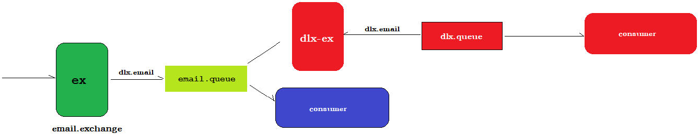
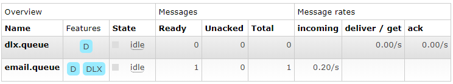
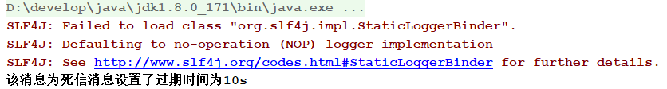

# 死信队列

DLX，全称为Dead-Letter-Exchange , 可以称之为死信交换机，也有人称之为死信邮箱。当消息在一个队列中变成死信(dead message)之后，它能被重新发送到另一个交换机中，这个交换机就是DLX ，

绑定DLX的队列就称之为死信队列。

消息变成死信：

* 消息被拒绝(Basic.reject/Basic.Nack)，并且设置requeue参数为false
* 消息过期
* 队列达到最大长度

DLX也是一个正常的交换机，和一般的交换机没有区别，它能在任何的队列上被指定，实际上就是设置某一个队列的属性。当这个队列中存在死信时，Rabbitmq就会自动地将这个消息重新发布到设置的DLX上去，

进而被路由到另一个队列，即死信队列。


使用死信队列可以对我们的消息进行二次发送，再次尝试消费。

 


当消息正常消费的请求下，可以被"蓝色"的consumer消费。

但是一单消息变成了"死信"，mq就会将消息发个dlx-ex(死信交换机)，而死信交换机可以将消息发送给与之绑定的死信队列，消息被死信队列所对应的消费者消费。

代码实现：

生产者：

```java
public class Producer {

    // 设置参数
    private static final String EX_EMAIL = "email.exchange" ;
    private static final String QUEUE_EMAIL = "email.queue" ;
    private static final String ROUTING_KAY_EMAIL = "dlx.email";
    private static final String EX_DLX = "dlx.exchange";
    private static final String QUEUE_DLX = "dlx.queue" ;

    public static void main(String[] args) throws IOException, TimeoutException {

        // 创建连接工厂
        ConnectionFactory connectionFactory = new ConnectionFactory();
        connectionFactory.setHost("127.0.0.1");
        connectionFactory.setPort(5672);
        connectionFactory.setUsername("guest");
        connectionFactory.setPassword("guest");
        connectionFactory.setVirtualHost("/");

        // 获取连接
        Connection connection = connectionFactory.newConnection();

        // 声明通道
        Channel channel = connection.createChannel();

        // 声明队列为路由模式
        channel.exchangeDeclare(EX_EMAIL , BuiltinExchangeType.DIRECT) ;

        // 声明死信交换机
        channel.exchangeDeclare(EX_DLX , BuiltinExchangeType.DIRECT) ;
        channel.queueDeclare(QUEUE_DLX , true , false , false , null ) ;
        channel.queueBind(QUEUE_DLX , EX_DLX , "dlx.email") ;

        // 声明工作队列,把死信交换机作为工作队列的属性设置给工作队列
        Map<String , Object> params = new HashMap<String, Object>() ;
        params.put("x-dead-letter-exchange" , EX_DLX) ;
        channel.queueDeclare(QUEUE_EMAIL , true , false , false , params) ;   // 指定私信消息对应的交换机

        // 完成正常队列的绑定
        channel.queueBind(QUEUE_EMAIL , EX_EMAIL , ROUTING_KAY_EMAIL) ;

        // 设置消息的属性信息
        AMQP.BasicProperties properties = new AMQP.BasicProperties.Builder()
                .deliveryMode(2)
                .contentEncoding("UTF-8")
                .expiration("10000")
                .build();

        // 发送消息
        channel.basicPublish(EX_EMAIL , ROUTING_KAY_EMAIL , properties, "该消息为死信消息设置了过期时间为10s".getBytes());

        // 释放资源
        connection.close();
    }

}
```

rabbitmq服务端查看：

 

消息被发送到了email.queue中，并且该队列绑定了一个死信交换机(DLX),10s以后，该消息没有被消费，变成死信，由Rabbitmq将消息发送到dlx.queue(死信队列中)。

 

消费者：

```java
public class Consumer {

    private static final String EX_DLX = "dlx.exchange";
    private static final String QUEUE_DLX = "dlx.queue" ;

    public static void main(String[] args) throws  Exception {

        // 创建连接工厂
        ConnectionFactory connectionFactory = new ConnectionFactory();
        connectionFactory.setHost("127.0.0.1");
        connectionFactory.setPort(5672);
        connectionFactory.setUsername("guest");
        connectionFactory.setPassword("guest");
        connectionFactory.setVirtualHost("/");

        // 创建连接
        Connection connection = connectionFactory.newConnection();
        Channel channel = connection.createChannel();

        // 声明死信交换机
        channel.exchangeDeclare(EX_DLX , BuiltinExchangeType.DIRECT) ;
        channel.queueDeclare(QUEUE_DLX , true , false , false , null) ;
        channel.queueBind(QUEUE_DLX , EX_DLX , "dlx.email") ;

        // 定义消费者
        DefaultConsumer consumer = new DefaultConsumer(channel){
            @Override
            public void handleDelivery(String consumerTag, Envelope envelope, AMQP.BasicProperties properties, byte[] body) throws IOException {
                System.out.println(new String(body));
            }
        } ;

        // 消费消息
        channel.basicConsume(QUEUE_DLX , true , consumer) ;

    }

}
```

控制台：

 