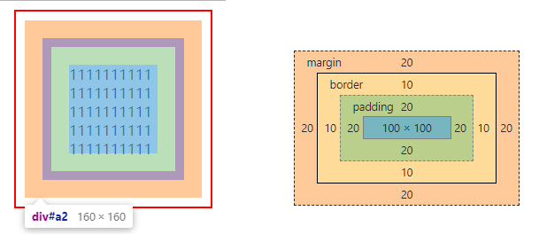

# css 问题汇总

## 1. 选择器的优先级问题

* 规则1：
不同类型的选择器，内联 > #id > .class > 元素，属性与定义的顺序无关，例如
```html
<style>
#p1 {
    color:red;
}
p {
    color:blue;
}
</style>
<p id="p1">111</p> <!-- 红色 -->
```
* 规则2：
同级别的选择器，定义在后面的属性会覆盖（层叠）定义在前面的样式，例如
```html
<style>
p {
    color:red;
}
p {
    color:blue;
}
</style>
<p>111</p> <!-- 蓝色 -->
```
* 例外情况
如果应用了伪类选择器，会提升优先级（但提升有限，好像不会超过 #id），观察浏览器样式覆盖以得到最后结论
```html
<style>
p:first-child{
    color:yellow;
}
.x {
    color:blue;
}
</style>
<div>
    <p class="x">111</p> <!-- 黄色 -->
</div>
```

## 2. 关于盒子模型的理解
```html
<style>
#a1 {
    border: 2px solid red;
    width:200px;
    height:200px;
    padding:10px;
    margin:10px;
}
#a2 {
    margin:20px;
    border: 10px solid blue;
    padding:20px;
    width:100px;
    height:100px;
    overflow-wrap:break-word;
}
</style>
<div id="a1">
    <div id="a2">11111111111111111111111111111111111111111111111111</div>
</div>
```

* 最外面的留白是 #a1 的 margin(10px)
* 红框是 #a1 的 border(2px)
* 红框与内部之间的留白是 #a1 的 padding(10px)
* 橙色是 #a2 的 margin(20px)
* 紫色是 #a2 的 border(10px)
* 浅绿色是 #a2 的 padding(20px)
* 最里面的浅蓝色是 #a2 的内容

## 3. 关于 box-sizing
`#a2` 盒子大小为：`box-sizing: content-box` 时
`#a2` 的真实宽度为 `100(width)+2*20(padding)+2*10(border)+2*20(margin) = 200`

`#a2` 盒子大小为：`box-sizing: border-box` 时
`#a2` 的真实宽度为 `100(width 包括了padding 和 border)+2*20(margin) = 140`