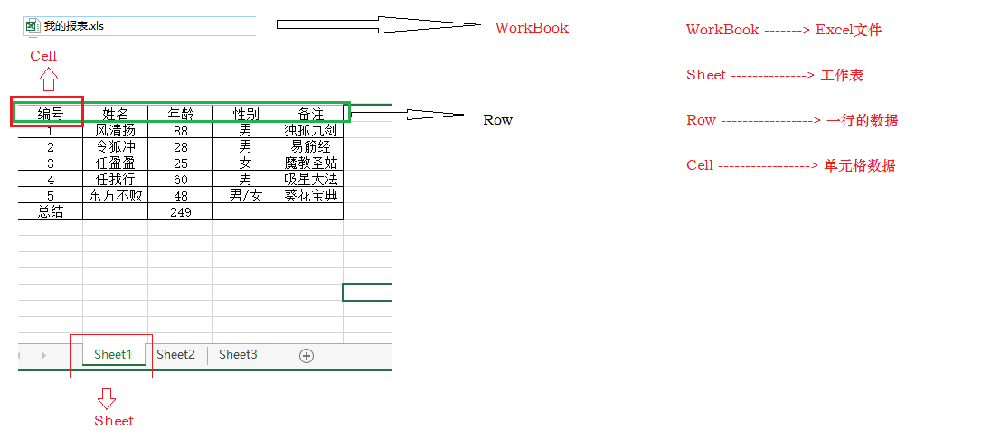

# POI

### pom.xml

``` xml
<dependencies>
    
    <dependency>
        <groupId>org.apache.poi</groupId>
        <artifactId>poi</artifactId>
        <version>3.9</version>
    </dependency>

    <dependency>
        <groupId>org.apache.poi</groupId>
        <artifactId>poi-ooxml</artifactId>
        <version>3.9</version>
    </dependency>

</dependencies>
```

 

### 解析Excel

``` java
public class ExcelParserDemo {

    public static void main(String[] args) throws Exception {

        String fileName = "D:\\develop\\excel\\我的报表.xls";
        Workbook workbook = null;

        if(fileName.endsWith(".xls")){
            workbook = new HSSFWorkbook(new FileInputStream(new File(fileName)));
        }else if(fileName.endsWith(".xlsx")){
            workbook = new XSSFWorkbook(new FileInputStream(new File(fileName)));
        }else{
            //...
        }

        parseExcel(workbook);

    }

    private static void parseExcel(Workbook workbook) {
        //获取Excel中的第一个Sheet
        Sheet sheet = workbook.getSheetAt(0);
        System.out.println(sheet.getSheetName());

        int rows = sheet.getPhysicalNumberOfRows();
        for (int i = 0 ; i < rows ; i++){
            Row row = sheet.getRow(i);
            int cellsNum = row.getPhysicalNumberOfCells();

            String rowValue = "";
            for (int j = 0 ; j < cellsNum ; j++){
                Cell cell = row.getCell(j);
                int cellType = cell.getCellType();

                switch (cellType){
                    case Cell.CELL_TYPE_STRING:
                        rowValue += cell.getStringCellValue()+"\t";
                        break;
                    case Cell.CELL_TYPE_BLANK:
                        rowValue += "\t";
                        break;
                    case Cell.CELL_TYPE_BOOLEAN:
                        rowValue += cell.getBooleanCellValue()+"\t";
                        break;
                    case Cell.CELL_TYPE_ERROR:
                        rowValue += cell.getErrorCellValue()+"\t";
                        break;
                    case Cell.CELL_TYPE_FORMULA:
                        rowValue += cell.getNumericCellValue()+"\t";
                        break;
                    case Cell.CELL_TYPE_NUMERIC:
                        rowValue += cell.getNumericCellValue()+"\t";
                        break;
                }

            }

            System.out.println(rowValue);

        }

    }

}
```

