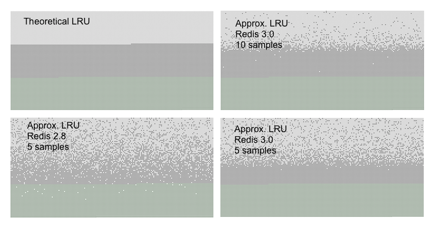
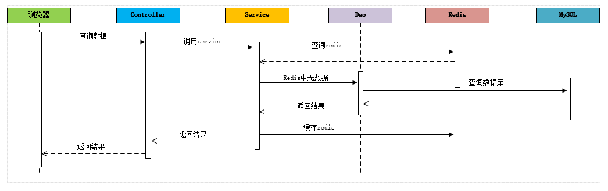

### Redis内存淘汰策略

```
概述 : 
	
	每台redis的服务器的内存都是有限的，而且也不是所有的内存都用来存储信息。
	
	而且redis的实现并没有在内存这块做太多的优化，所以实现者为了防止内存过于饱和，采取了一些措施来管控内存。
	
	
Redis的内存设置 : 
	
	maxmemory <bytes> 
	
	
内存淘汰(置换)策略 : 
	
	1). volatile-lru -> remove the key with an expire set using an LRU algorithm
    	
    	只从设置失效（expire set）的key中选择最近最不经常使用的key进行删除，用以保存新数据
    	
    2). allkeys-lru -> remove any key according to the LRU algorithm
    	
    	优先删除掉最近最不经常使用的key，用以保存新数据
    	
    3). volatile-random -> remove a random key with an expire set
    	
    	只从设置失效（expire set）的key中，(随机)选择一些key进行删除，用以保存新数据
    	
    4). allkeys-random -> remove a random key, any key
    	
    	随机从all-keys中(随机)选择一些key进行删除，用以保存新数据 
    	
    5). volatile-ttl -> remove the key with the nearest expire time (minor TTL)
    	
    	只从设置失效（expire set）的key中，选出存活时间（TTL）最短的key进行删除，用以保存新数据
    	
    6). noeviction -> don't expire at all, just return an error on write operations
		
		不进行淘汰，表示即使内存达到上限也不进行置换，所有能引起内存增加的命令都会返回error
	
    配置 : 
    	
    	maxmemory-policy noeviction
    
样本数量 : 
	
	maxmemory-samples 5
	
	Redis 中的 LRU 不是严格意义上的LRU算法实现，是一种近似的 LRU 实现，主要是为了节约内存占用以及提升性能。Redis 有这样一个配置 —— maxmemory-samples，Redis 的 LRU 是取出配置的数目的key，然后从中选择一个最近最不经常使用的 key 进行置换，默认的 5，可以通过调整样本数量来取得 LRU 置换算法的速度或是精确性方面的优势。

```

 

### 缓存穿透

```
缓存穿透，是指查询一个数据库一定不存在的数据。正常的使用缓存流程大致是，数据查询先进行缓存查询，如果key不存在或者key已经过期，再对数据库进行查询，并把查询到的对象，放进缓存。如果数据库查询对象为空，则不放进缓存。
```

 

``` java
@Override
public List<TbContent> findByCategoryId(Long categoryId) {
	// 加入缓存的代码:
	List<TbContent> list = (List<TbContent>) redisTemplate.boundHashOps("content").get(categoryId);
	
	if(list==null){
		System.out.println("查询数据库===================");
		TbContentExample example = new TbContentExample();
		Criteria criteria = example.createCriteria();
		// 有效广告:
		criteria.andStatusEqualTo("1");
		
		criteria.andCategoryIdEqualTo(categoryId);
		// 排序
		example.setOrderByClause("sort_order");
		
		list = contentMapper.selectByExample(example);
		if(list !=null){
			redisTemplate.boundHashOps("content").put(categoryId, list);
        }
	}else{
		System.out.println("从缓存中获取====================");
	}
	
	return list;
}			
```

解决方案

``` java
@Override
public List<TbContent> findByCategoryId(Long categoryId) {
	// 加入缓存的代码:
	List<TbContent> list = (List<TbContent>) redisTemplate.boundValueOps("content_"+categoryId).get();
	
	if(list==null){
		System.out.println("查询数据库===================");
		TbContentExample example = new TbContentExample();
		Criteria criteria = example.createCriteria();
		// 有效广告:
		criteria.andStatusEqualTo("1");
		
		criteria.andCategoryIdEqualTo(categoryId);
		// 排序
		example.setOrderByClause("sort_order");
		
		list = contentMapper.selectByExample(example);
		if(list !=null){
			redisTemplate.boundValueOps("content_"+categoryId).set(list); //-1
            
        }else{
            redisTemplate.boundValueOps("content_"+categoryId).set(null); //null
            redisTemplate.expire("content_"+categoryId,7200, TimeUnit.SECONDS);
        }
        
	}else{
		System.out.println("从缓存中获取====================");
	}
	
	return list;
}
```


### 缓存击穿

```
	缓存击穿，是指一个key非常热点，在不停的扛着大并发，大并发集中对这一个点进行访问，当这个key在失效的瞬间，持续的大并发就穿破缓存，直接请求数据库，就像在一个屏障上凿开了一个洞。

解决方案 : 
	
	1). 对热点数据, 不设置过期时间 ;  
	
	2). 互斥锁
	
```

``` java
public class RedisDemo {

    private static Lock lock = new ReentrantLock();

    public static String getData(String key) throws InterruptedException {
        
        String result = getDataFromRedis(key);//从redis获取数据

        if(result == null){ // 如果数据为null , 需要从数据库中获取
            
            if(lock.tryLock()){ //尝试获取锁
                
                result = getDataFromMysql(key); //从数据库中查询
                
                if(result != null){ //如果查询到数据, 就缓存在redis中
                    saveDataToRedis(key,result);
                }
                lock.unlock();//释放锁
            }else{
                TimeUnit.MILLISECONDS.sleep(100);
                result = getData(key);
            }
        }
        return result;
    }

    private static void saveDataToRedis(String key, String result) {
        System.out.println("保存数据到redis中 , key - value ");
    }

    private static String getDataFromMysql(String key) {
        System.out.println("从数据库中获取数据 ");
        return null;
    }

    public static String getDataFromRedis(String key){
        System.out.println("从redis中获取数据 ");
        return null;
    }
}
```


### 缓存雪崩

```
缓存雪崩，是指在某一个时间段，缓存集中过期失效。

产生雪崩的原因之一，比如在写本文的时候，马上就要到双十二零点，很快就会迎来一波抢购，这波商品时间比较集中的放入了缓存，假设缓存一个小时。那么到了凌晨一点钟的时候，这批商品的缓存就都过期了。而对这批商品的访问查询，都落到了数据库上，对于数据库而言，就会产生周期性的压力波峰。

```

解决方案

```
1). 如果设置缓存的过期时间 , 需要根据业务划分 , 不同类型的数据, 可以设置不同的过期时间, 不要设置为相同的过期时间, 从而造成缓存在同一个时间点过期 ;

2). 只查询redis , 不查询数据库 ;
	

```

